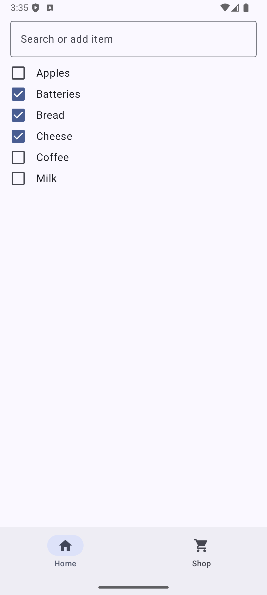
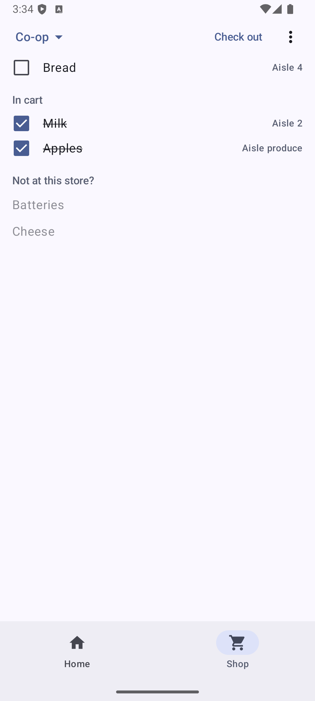
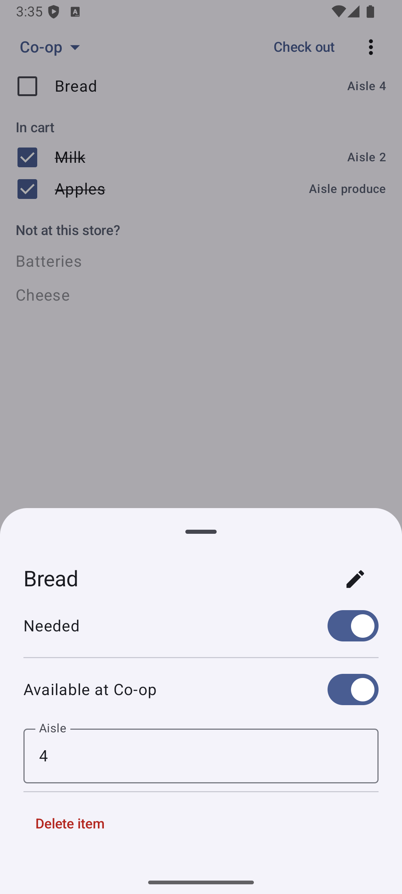

# Retro Shopper (Claude Fable 5 experiment)

> **Human note:** This is an experiment to see how much Claude Fable 5 can do on a greenfield project in one shot. Total cost: **$44.40** worth of tokens at API prices. See [DESIGN_NOTES.md](DESIGN_NOTES.md) (my input) and [PLAN.md](PLAN.md) (Claude's plan after asking me questions). See [more notes at the end of this file](#claude-fable-5-notes).

A small Android shopping-list app loosely inspired by the classic PalmPilot
[HandyShopper](https://palmdb.net/app/handyshopper). One shared item list, with
per-store availability and aisle locations, so the list you see in the store is
sorted in walking order.

| Home: mark what's needed | Shop: aisle order + cart | Item details |
| --- | --- | --- |
|  |  |  |

## How it works

- **Home tab** — every item you ever buy, alphabetical, with a "needed"
  checkbox. The search box filters; typing a new name offers *Add "…"*.
- **Shop tab** — pick a store. Needed items available there appear in aisle
  order; checking one puts it *in the cart* (reversible — no lost items from a
  stray tap). Needed items never recorded at this store sit dimmed under
  *"Not at this store?"* — tap one to record that it's here and which aisle.
- **Check out** — one tap when you're done: everything in the cart stops being
  needed. Nothing else changes.
- **Long-press any item** for details: rename, delete, needed, and per-store
  availability/aisle.

Design history and architecture live in [DESIGN_NOTES.md](DESIGN_NOTES.md) and
[PLAN.md](PLAN.md).

## Building

Requirements: JDK 21 and an Android SDK. The easiest SDK setup is the
[Android CLI](https://developer.android.com/tools/agents): `android sdk
install` puts a lean SDK in `~/Android/Sdk` (or point `local.properties` at an
existing one).

```sh
./gradlew build          # compile + lint + all tests
./gradlew test           # headless test suite only
```

The test suite runs entirely on the JVM — including the Room database (real
SQLite via the bundled driver) and the Compose UI tests (Robolectric). No
emulator needed.

## Installing on your phone (sideloading)

This app is deliberately not on any app store.

**Easiest path:** download `retro-shopper.apk` from the
[latest release](https://github.com/emk/fable-retro-shopper-android/releases/tag/latest)
on your phone and open it from the Files app (or your browser's downloads).
Android will ask you to allow installs from that app the first time — that's
the expected "unknown sources" prompt for anything outside an app store. Every
push to `main` refreshes this release, and updates install right over the old
version without losing your data.

Alternatively, build and install it yourself. (Note: your own debug build and
the released APK are signed with different keys, so switching between them
means uninstalling first — which deletes the app's data.)

1. Build the debug APK:

   ```sh
   ./gradlew assembleDebug
   # -> app/build/outputs/apk/debug/app-debug.apk
   ```

2. On the phone, enable **Developer options** (tap *Settings → About phone →
   Build number* seven times), then turn on **USB debugging** inside
   *Settings → System → Developer options*.

3. Connect the phone over USB (accept the debugging prompt) and install:

   ```sh
   adb install -r app/build/outputs/apk/debug/app-debug.apk
   ```

   Or, with the Android CLI: `android run --apks=app/build/outputs/apk/debug/app-debug.apk`

No USB cable handy? Copy `app-debug.apk` to the phone (Drive, email,
`adb wifi`, …), open it from the Files app, and allow "install unknown apps"
when prompted. Updates installed over an existing copy keep your data; only
uninstalling removes the database.

## Status

Feature-complete for the original design: needed list, per-store
availability + aisles, cart with checkout, item/store management. Prices,
quantities, and multi-device sync are out of scope for now — though the data
layer is deliberately isolated behind a repository so a Firestore-style
backend could slot in later.

## Claude Fable 5 notes

> **Human note:** Costs and time:
>
> ```
> Total cost:            $44.40
> Total duration (API):  47m 49s
> Total duration (wall): 1h 45m 51s
> Total code changes:    2660 lines added, 313 lines removed
> Usage by model:
>     claude-haiku-4-5:  75.1k input, 3.3k output, 0 cache read, 0 cache write ($0.0917)
>       claude-fable-5:  15.7k input, 165.1k output, 30.2m cache read, 284.2k cache write ($44.31)
> ```
>
> **Claude's final sign-off.** A pleasure — this was a genuinely fun one. HandyShopper was a great pick for a re-creation: small enough to finish, but with one real design problem in the middle (the cart/checkout semantics and two-state availability) that made the planning conversation actually matter.
> 
> For your catching-up-on-Android goal, the bits I'd flag as "2026 idioms worth internalizing" from this codebase: Compose + StateFlow<UiState> ViewModels as the default screen pattern, Navigation 3's serializable NavKeys, Room's KMP-era testability (real database in plain JVM tests via the bundled SQLite driver), version catalogs (libs.versions.toml) as the dependency source of truth, and how far you can get with a hand-wired AppContainer before Hilt earns its complexity — which for an app this size is "all the way."
